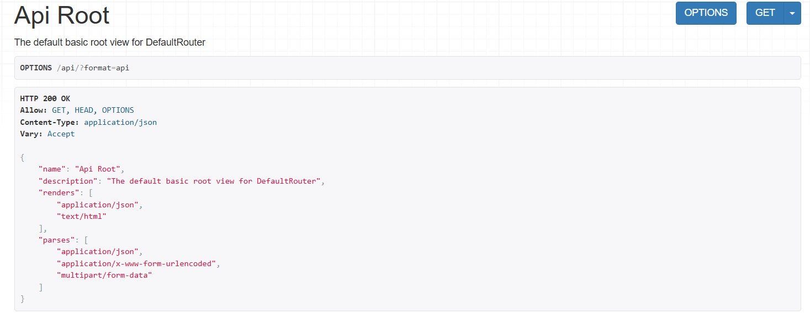
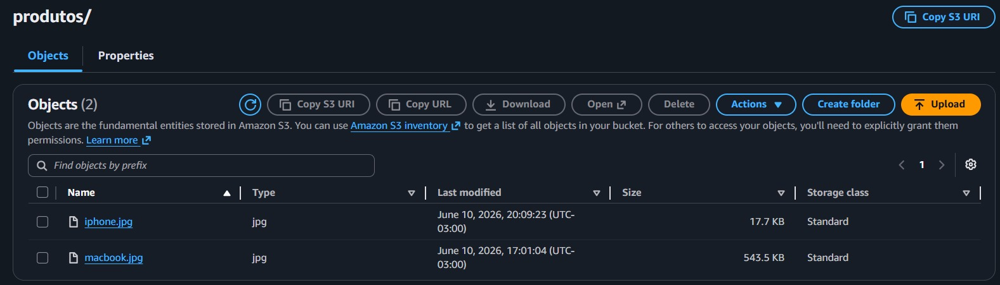
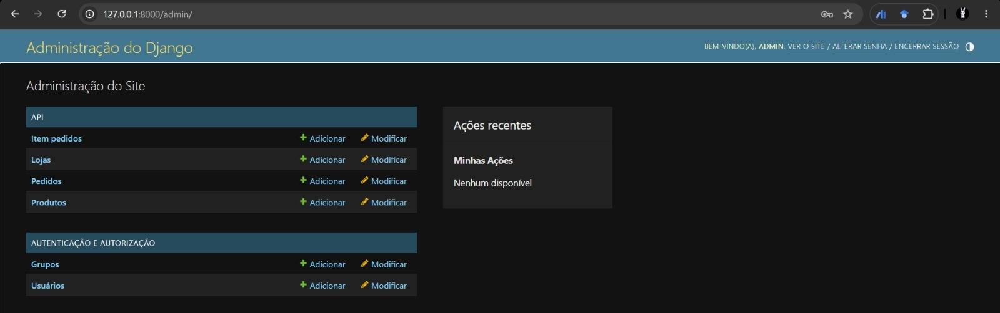

# AP2 — E-commerce AWS (Django REST + RDS + S3 + Elastic Beanstalk)

API REST de e-commerce desenvolvida com Django REST Framework, evoluindo a AP1 para uma arquitetura em nuvem com banco de dados gerenciado (AWS RDS) e armazenamento de mídia (AWS S3), publicada via Elastic Beanstalk.

---

## Integrantes do Grupo

| Nome | |
|---|---|
| Bryan Amorim | |
| Júlia Dominguez | |
| Marcelle Lohane | |
| Gabriel Corrêa | |
| Mateus Sachinho | |
| Gustavo Salvador | |

---

## API em Produção

**URL base:** http://gabriel-marcelle.us-east-1.elasticbeanstalk.com/

| Recurso | Endpoint |
|---|---|
| Produtos | `/api/produtos/` |
| Lojas | `/api/loja/` |
| Pedidos | `/api/pedido/` |
| Itens de Pedido | `/api/itens-pedido/` |
| Health Check | `/api/health/` |
| Django Admin | `/admin/` |

---

## Arquitetura da Solução

### AP1 → AP2

| Componente | AP1 | AP2 |
|---|---|---|
| Banco de dados | SQLite (local) | AWS RDS (MySQL) |
| Arquivos de mídia | Sistema de arquivos local | AWS S3 |
| Deploy | Elastic Beanstalk (app básico) | Elastic Beanstalk + RDS + S3 integrados |
| Modelos | Produto, Loja | Produto, Loja, Pedido, ItemPedido |

```
┌──────────────────────────────────────────────────┐
│             AWS Elastic Beanstalk                 │
│                                                  │
│        Gunicorn + Django REST Framework          │
│               ↙                 ↘               │
│   AWS RDS (MySQL)         AWS S3 (mídia)         │
└──────────────────────────────────────────────────┘
```

---

## Modelos de Dados

- **Loja** — nome, localização, bairro
- **Produto** — nome, descrição, preço, estoque, imagem (armazenada no S3), atributos (JSON), loja (FK → Loja)
- **Pedido** — cliente, data de criação
- **ItemPedido** — pedido (FK → Pedido), produto (FK → Produto), quantidade

---

## Campo JSON — Atributos Dinâmicos de Produto

O modelo `Produto` possui um campo `atributos` (JSONField) para armazenar características variáveis que diferem por categoria — sem necessidade de criar colunas para cada especificação.

### Exemplo de payload com atributos

```json
POST /api/produtos/
{
  "nome": "Notebook Dell Inspiron",
  "preco": "3500.00",
  "estoque": 5,
  "atributos": {
    "marca": "Dell",
    "ram_gb": 16,
    "cor": "preto",
    "especificacoes": {
      "cpu": "i7",
      "armazenamento": "512GB SSD"
    }
  }
}
```

### Filtros disponíveis via query params

```bash
# Filtro por marca (dentro do JSON)
GET /api/produtos/?marca=Dell

# Filtro por cor (dentro do JSON)
GET /api/produtos/?cor=preto

# Filtro combinado: relacional (loja) + JSON (marca)
GET /api/produtos/?loja=1&marca=Dell

# Outros atributos suportados: ram_gb, tamanho, voltagem
GET /api/produtos/?ram_gb=16
```

### Quando usar campo relacional e quando usar JSONField

| Situação | Use campo relacional | Use JSONField |
|---|---|---|
| Atributo presente em **todos** os produtos | ✅ (ex: `preco`, `estoque`) | ❌ |
| Atributo que precisa de **FK ou integridade** | ✅ (ex: `loja_id`) | ❌ |
| Atributos que **variam por categoria** | ❌ | ✅ (ex: `ram_gb` só faz sentido para eletrônicos) |
| Estrutura **imprevisível ou extensível** | ❌ | ✅ (ex: especificações técnicas livres) |
| Necessidade de **índice de alta performance** | ✅ | ⚠️ Possível, mas mais complexo |

**Resumo:** use campo relacional para dados estruturados e obrigatórios; use JSONField para atributos opcionais, variáveis por tipo de produto, ou estruturas que ainda vão evoluir.

---

## Execução Local

### Pré-requisitos

- Python 3.11+
- Docker (para o banco MySQL local)

### Opção rápida — script de bootstrap

**Windows:**
```bat
git clone <url-do-repositorio>
cd AP2_Ecommerce_AWS
setup.bat
```

**Linux/Mac:**
```bash
git clone <url-do-repositorio>
cd AP2_Ecommerce_AWS
bash setup.sh
```

O script cria o `venv`, instala dependências, sobe o MySQL via Docker, aplica migrations e orienta a criação do superusuário.

### Passo a passo manual

```bash
# 1. Clonar o repositório
git clone <url-do-repositorio>
cd AP2_Ecommerce_AWS

# 2. Criar e ativar o ambiente virtual
python -m venv venv
source venv/bin/activate        # Linux/Mac
# venv\Scripts\activate         # Windows

# 3. Instalar dependências
pip install -r requirements.txt

# 4. Configurar variáveis de ambiente
cp .env.example .env
# Edite o .env se necessário (credenciais do banco local)

# 5. Subir MySQL local via Docker
docker run -d --name mysql-dev \
  -e MYSQL_ROOT_PASSWORD=root \
  -e MYSQL_DATABASE=ecommerce_dev \
  -p 3306:3306 mysql:8

# 6. Aplicar migrações
python manage.py migrate

# 7. Criar superusuário admin
python manage.py createsuperuser
# Usuário sugerido: root

# 8. Iniciar o servidor de desenvolvimento
python manage.py runserver
```

- API disponível em: `http://localhost:8000/api/`
- Django Admin em: `http://localhost:8000/admin/`

> Em desenvolvimento, o projeto usa MySQL local via Docker e salva imagens na pasta `/media/`. As variáveis de ambiente do RDS e do S3 são opcionais — só são ativadas quando presentes.

---

## Deploy no AWS Elastic Beanstalk

### 1. Criar a instância RDS (MySQL)

1. No console AWS, acesse **RDS → Criar banco de dados**.
2. Selecione **MySQL**.
3. Configure usuário, senha e nome do banco.
4. Em **Conectividade**, associe o Security Group ao mesmo VPC do Elastic Beanstalk.
5. Anote: `host`, `porta`, `nome do banco`, `usuário` e `senha`.

### 2. Criar o Bucket S3 para mídia

1. No console AWS, acesse **S3 → Criar bucket**.
2. Defina um nome único (ex.: `meu-projeto-media`).
3. Desmarque **Bloquear todo acesso público** para permitir leitura pública das imagens.
4. Adicione política de bucket para `s3:GetObject` público, se necessário.

### 3. Configurar variáveis de ambiente no Elastic Beanstalk

No console EB: **Configuração → Software → Propriedades do ambiente**

| Variável | Descrição |
|---|---|
| `DJANGO_SETTINGS_MODULE` | **`myproject.settings.prod`** (obrigatório em produção) |
| `DJANGO_SECRET_KEY` | Chave secreta do Django |
| `RDS_HOSTNAME` | Endpoint do RDS |
| `RDS_PORT` | Porta do banco (padrão `3306`) |
| `RDS_DB_NAME` | Nome do banco |
| `RDS_USERNAME` | Usuário do banco |
| `RDS_PASSWORD` | Senha do banco |
| `AWS_STORAGE_BUCKET_NAME` | Nome do bucket S3 |
| `AWS_S3_REGION_NAME` | Região do bucket (ex.: `us-east-1`) |

### 4. Gerar o pacote e fazer deploy

```bash
# Gerar app.zip excluindo arquivos desnecessários (Windows PowerShell)
Compress-Archive -Path * -DestinationPath app.zip `
  -Force

# Ou manualmente via console EB:
# Elastic Beanstalk → Aplicação → Fazer upload e implantar → app.zip
```

```bash
# Via EB CLI
eb deploy
```

O hook `.platform/hooks/predeploy/01_django_setup.sh` executa automaticamente `collectstatic` e `migrate` a cada deploy.

### 5. Criar superusuário no ambiente AWS

```bash
# Acessar o ambiente via SSH
eb ssh

# Dentro do servidor
source /var/app/venv/*/bin/activate
cd /var/app/current
python manage.py createsuperuser
```

---

## Evidências

### API em Produção


### RDS — Instância Ativa


### S3 — Arquivos de Mídia


### Django Admin


---

## Boas Práticas de Configuração

- Todas as credenciais são lidas via variáveis de ambiente — nenhum segredo no código-fonte.
- `DEBUG=False` garantido em produção via `myproject/settings/prod.py`.
- Settings separados por ambiente: `base.py` (comum), `dev.py` (local), `prod.py` (AWS).
- Arquivos estáticos servidos pelo **WhiteNoise** (sem necessidade de S3).
- Arquivos de mídia (imagens de produtos) armazenados e servidos diretamente pelo **S3**.
- Hook de pré-deploy aplica migrações e coleta estáticos automaticamente a cada deploy.
- Upload de imagem validado antes de chegar ao S3: tipos aceitos (JPEG, PNG, WebP) e limite de 5 MB.

---

## Troubleshooting

| Problema | Verificação |
|---|---|
| `migrate` falha no deploy | Verificar Security Group do RDS — liberar porta 3306 para o SG do EB |
| Imagem não aparece na API | Confirmar `AWS_STORAGE_BUCKET_NAME` e política pública do bucket S3 |
| Erro 500 após deploy | Verificar logs: `eb logs` ou console EB → Logs |
| Django Admin sem CSS | Verificar configuração do WhiteNoise e rodar `collectstatic` |
| Variáveis não reconhecidas | Console EB → Configuração → Software → conferir todas as variáveis |

---

## Tecnologias

| Biblioteca | Versão | Uso |
|---|---|---|
| Django | 4.2.13 | Framework web |
| djangorestframework | 3.15.2 | API REST |
| django-storages + boto3 | 1.14.4 / 1.34.131 | Integração com S3 |
| PyMySQL | 1.1.1 | Conector MySQL/RDS |
| WhiteNoise | 6.7.0 | Arquivos estáticos |
| Gunicorn | 22.0.0 | Servidor WSGI |
| Pillow | 10.4.0 | Processamento de imagens |

---

## Documentação da AP2

### Etapas Realizadas

**Etapa 1 — Preparação e revisão da AP1**

Partimos do projeto funcional da AP1, garantindo que a aplicação rodava corretamente em ambiente local antes de iniciar as alterações. Em seguida, foi criado um novo repositório para a AP2, permitindo organizar separadamente as evoluções do projeto. Também foram revisados os modelos existentes (Produto e Loja) antes da expansão para o cenário de e-commerce.

**Etapa 2 — Evolução do modelo de dados (E-commerce)**

Adicionamos os modelos `Pedido` e `ItemPedido` para compor o fluxo básico de carrinho de compras. O modelo `Produto` foi atualizado com o campo `imagem` (ImageField) para suportar upload de arquivos. As migrações foram geradas e aplicadas localmente.

**Etapa 3 — Configuração do AWS RDS (MySQL)**

Criamos uma instância MySQL no AWS RDS. O `settings.py` foi ajustado para detectar automaticamente a presença da variável `RDS_HOSTNAME` e, quando presente, usar o banco remoto; caso contrário, mantém o SQLite local. As migrações foram executadas no banco remoto após o primeiro deploy bem-sucedido.

**Etapa 4 — Configuração do AWS S3 para mídia**

Criamos um bucket S3 dedicado aos arquivos de mídia dos produtos. Instalamos `django-storages` e `boto3`, configurando o backend `S3Boto3Storage` condicionalmente pela variável `AWS_STORAGE_BUCKET_NAME`. O campo `imagem` do modelo `Produto` passou a persistir diretamente no S3 em produção.

**Etapa 5 — Deploy no Elastic Beanstalk**

As variáveis de ambiente foram cadastradas no painel do EB. O hook de pré-deploy (`.platform/hooks/predeploy/01_django_setup.sh`) foi configurado para rodar `collectstatic` e `migrate` automaticamente a cada deploy. O pacote `app.zip` foi gerado e enviado via console AWS.

**Etapa 6 — Validação fim a fim**

Validamos todos os endpoints (GET, POST, PUT, DELETE), o upload de imagem de produto com persistência confirmada no S3, o acesso ao Django Admin com usuário `admin` e a conectividade com o RDS.

---

### Principais Decisões Técnicas

**Banco de dados via variável de ambiente**
Optamos por uma lógica condicional no `settings.py`: se `RDS_HOSTNAME` estiver definida, o Django usa MySQL/RDS; do contrário, usa SQLite. Isso permite que qualquer integrante do grupo rode o projeto localmente sem nenhuma configuração extra, enquanto o ambiente AWS usa o banco gerenciado automaticamente.

**S3 apenas para mídia, WhiteNoise para estáticos**
Decidimos não configurar o S3 para arquivos estáticos (CSS, JS), usando o WhiteNoise para isso. O S3 ficou exclusivo para arquivos de mídia (imagens de produtos). Essa escolha simplifica a configuração e reduz custos, já que arquivos estáticos são gerados no deploy e servidos diretamente pelo servidor.

**Hook de pré-deploy para migrações automáticas**
Em vez de executar migrações manualmente via SSH após cada deploy, criamos o script `.platform/hooks/predeploy/01_django_setup.sh`. O script é tolerante a falhas — se o `migrate` falhar (por exemplo, por um Security Group mal configurado), o deploy continua e exibe um aviso no log, evitando que um erro de banco bloqueie o processo inteiro.

**Sem autenticação na API**
Para fins didáticos, a API foi configurada com `AllowAny` no DRF. Em um ambiente de produção real, seria necessário adicionar autenticação (JWT ou Token) antes de expor os endpoints publicamente.

**Uso de PyMySQL em vez de mysqlclient**
O `mysqlclient` exige compilação de dependências C, o que pode causar problemas em ambientes Windows e no ambiente de build do EB. O `PyMySQL` é uma implementação pura em Python, instalado sem dependências externas, tornando o processo de deploy mais previsível.

---

### Dificuldades e Soluções

**Security Group bloqueando conexão com o RDS**

*Problema:* Após criar a instância RDS, as migrações falhavam com erro de conexão recusada, tanto localmente quanto no EB.

*Solução:* No console AWS, editamos o Security Group do RDS para adicionar uma regra de entrada liberando a porta `3306` para o Security Group do Elastic Beanstalk. Para testes locais, adicionamos temporariamente o IP da máquina ao mesmo Security Group.

---

**Imagens de produtos não aparecendo após upload**

*Problema:* O upload via API retornava 200, mas a URL da imagem na resposta apontava para o caminho local `/media/...` em vez do S3.

*Solução:* A variável de ambiente `AWS_STORAGE_BUCKET_NAME` não estava cadastrada corretamente no EB. Após corrigi-la e fazer redeploy, o Django passou a usar o backend S3 e as URLs passaram a apontar para `https://<bucket>.s3.amazonaws.com/`.

---

**Arquivos estáticos do Django Admin sem estilo (CSS)**

*Problema:* Após o primeiro deploy, o Django Admin carregava sem CSS.

*Solução:* O hook de pré-deploy executa `collectstatic --noinput` antes de cada deploy, copiando os estáticos para `staticfiles/`. O WhiteNoise serve essa pasta automaticamente. O problema ocorreu na primeira vez porque o hook ainda não existia; após adicioná-lo, o CSS voltou a funcionar normalmente.

---

**Geração do app.zip no Windows incluindo arquivos indesejados**

*Problema:* O zip gerado no Windows incluía a pasta `venv/`, o `db.sqlite3` e arquivos `.pyc`, aumentando o tamanho do pacote e causando conflitos no EB.

*Solução:* Usamos o PowerShell para selecionar manualmente apenas os diretórios e arquivos necessários, excluindo `venv/`, `__pycache__/`, `*.pyc`, `db.sqlite3` e `media/` antes de compactar.
